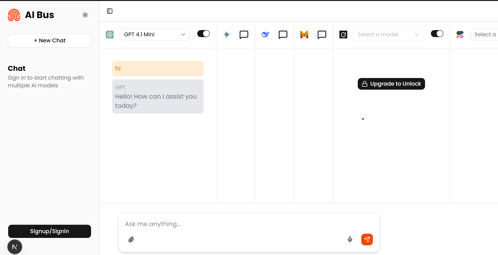

# AIBus

>AIBus is a modern multi-model AI SaaS platform built with Next.js, React, Clerk authentication, and Firebase. It provides a seamless interface for interacting with multiple AI models, user management, and credit-based usage.



## Features
- Multi-model AI chat interface
- User authentication (Clerk)
- Credit and usage tracking
- Responsive UI with Tailwind CSS
- Firebase integration

## Tech Stack
- Next.js 16
- React 19
- Clerk for authentication
- Firebase
- Tailwind CSS & Shadcn UI
- Axios, Radix UI, Lucide React

## Getting Started
1. Install dependencies:
	```bash
	npm install
	```
2. Start the development server:
	```bash
	npm run dev
	```
3. Open [http://localhost:3000](http://localhost:3000) in your browser.

## Project Structure
- `app/` — Main application pages and API routes
- `components/` — Reusable UI components
- `config/` — Configuration files (Firebase, ArcJet, etc.)
- `context/` — React context providers
- `hooks/` — Custom React hooks
- `lib/` — Utility functions


